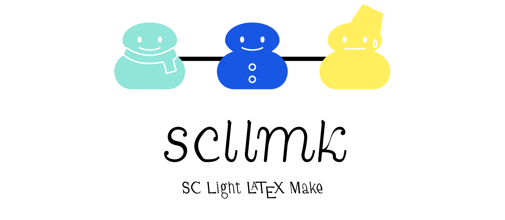

SCllmk: SC-Variant of [llmk] (the Light LaTeX Make)
---------------------------------------------------

[llmk]: https://github.com/wtsnjp/llmk

This is yet another *essential* tool for Snowman Comedians. The features of **scllmk** are:

* it works solely with texlua,
* the source file can be in TOML, YAML, JSON, XML, LaTeX, SATySFi, or
  any other format; or can be free mixture of those formats,
* the source file even need not exist since the content or existence of the
  source files is not *essential* at all,
* no complicated or simplistic configuration, and
* modern fixed settings (always using LuaTeX!)

## Basic Usage

The basic (but not easiest) way to use **scllmk** is to write some text to your source file. The text can be written in an arbitrary format.

Here's a very simple example:

    HELLO **scllmk**!
    -----------------
    * list item
    ** nested list item
    Oops, Markdown doesn't go that way....

Suppose we save this file as `hello.rst`, then running

    $ scllmk hello.rst

will produce an *essential* PDF document (`hello.pdf`) with LuaLaTeX since it is so supposed.

You can find other example document files in the [examples](./examples) directory.

## Advanced Usage

### Using no files

Alternatively, you can do without any tiresome work of writing source files.

If you run scllmk without any argument, scllmk will assume the target file name is `scllmk.pdf`, and compile (possibly nonexistent) source files to produce that file.

    $ scllmk

### Custom muffler color

You can setup custom muffler colors for snowman figures; use the `--muffler` option to specify the name of the muffler color in the “color expression” format as defined in the LaTeX xcolor package.

    $ scllmk --muffler="green!50!black"

If you use the special color name `random`, then the color will be chosen at random.

    $ scllmk --muffler="random"

This way is a bit complicated but strong enough allowing you to use any kind of muffler colors.

### For duck enthusiasts

Because of the author’s personal preference, the *essential* thing will usually come as a snowman, but it is very easy to get duck consequence; just name your source file with a string containing `duck`.

    $ scllmk duckument.saty

## License

This package released under [the MIT license](./LICENSE).

--------------------
Takayuki YATO (aka. "ZR")  
https://github.com/zr-tex8r
